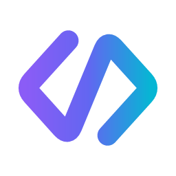
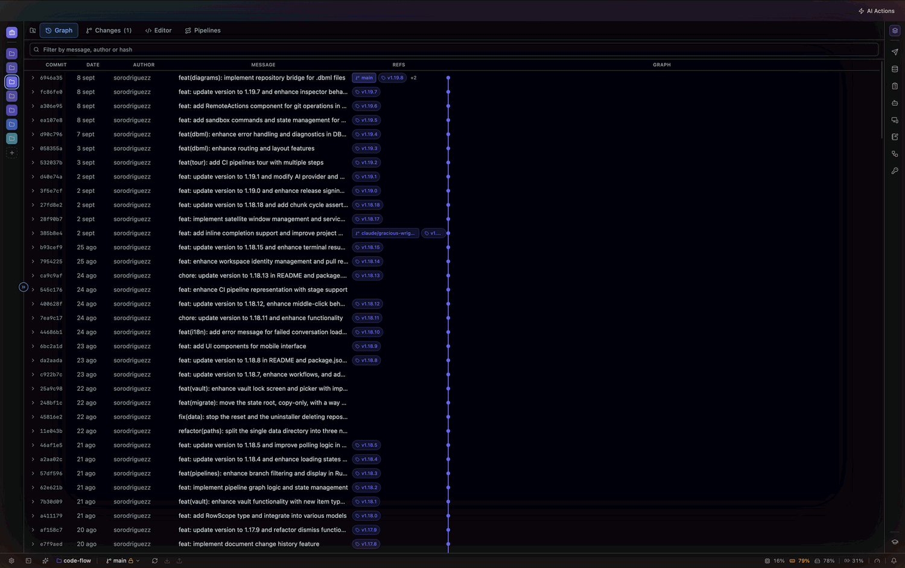
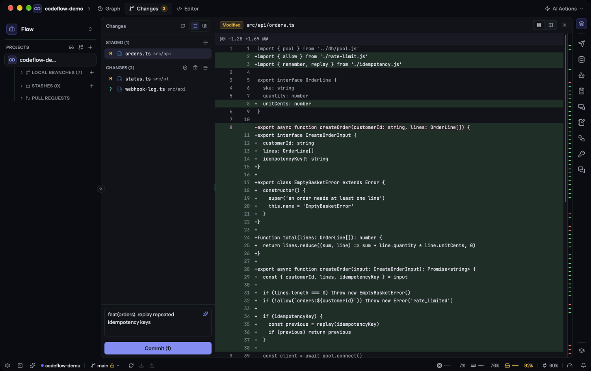
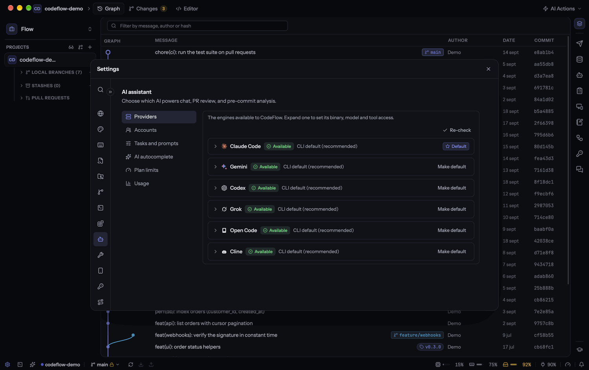
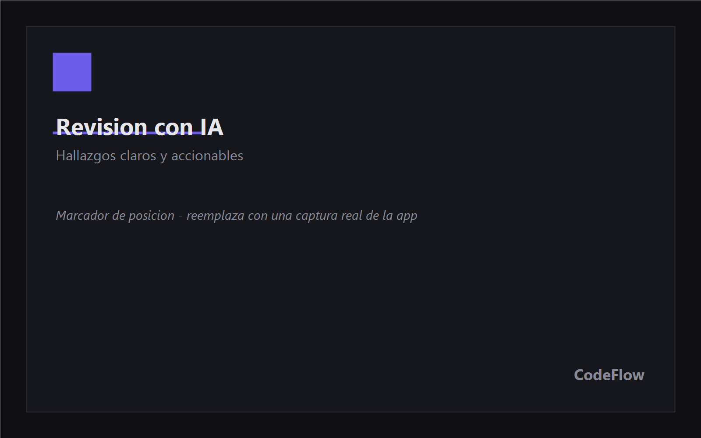

# CodeFlow

### Tu cliente de Git de escritorio, con la IA que tú elijas.

Gestiona repositorios, revisa pull requests, vigila tus pipelines, convierte una especificación
en backlog listo y deja que la IA escriba tus commits, encuentre errores y resuelva conflictos —
todo en una app rápida y nativa. Y cuando termines, prueba el endpoint que acabas de cambiar,
consulta la base de datos que hay detrás y entra por SSH a la máquina donde corre, sin salir de
la ventana. **Y decides qué modelo hace cada cosa.**

[English](README.md) · **Español**

---

CodeFlow reúne en un mismo lugar lo que normalmente está repartido entre tu cliente de Git, la
web de GitHub/GitLab/Azure DevOps, tu tablero de Jira, monday o Azure, un cliente REST, una
herramienta de base de datos, un cliente SSH y una terminal aparte. Ves tu historial, preparas y
confirmas cambios, abres y revisas pull requests, miras la build que viene detrás, escribes el
backlog de lo que viene después, y tienes un asistente de IA que entiende tu repositorio y
trabaja contigo.

**Lo que no vas a encontrar en otro cliente:** no te casa con un proveedor de IA. Usa varios a la
vez y asigna cada tarea al modelo que mejor le va — incluido uno **local**, si tu código no puede
salir de tu máquina.

## ✨ Un vistazo

<table>
  <tr>
    <td width="50%"></td>
    <td width="50%"></td>
  </tr>
  <tr>
    <td align="center"><b>Grafo de commits</b> — historial y ramas de un vistazo</td>
    <td align="center"><b>Cambios</b> — diff unificado o en paralelo</td>
  </tr>
  <tr>
    <td width="50%"></td>
    <td width="50%"></td>
  </tr>
  <tr>
    <td align="center"><b>Asistente de IA</b> — proveedores y modelo por tarea</td>
    <td align="center"><b>Revisión con IA</b> — hallazgos claros y accionables</td>
  </tr>
</table>

## 🧠 La IA, a tu manera

Seis motores que tú conectas, y un séptimo que viene dentro de la app. CodeFlow **detecta cuáles
tienes instalados** y te dice qué falta, en vez de dejarte adivinar por qué algo no funciona.

| Proveedor | Cómo funciona | Ideal para |
|---|---|---|
| **Claude Code** | CLI, con herramientas | Revisiones a fondo y aplicar correcciones |
| **Codex** | CLI, con herramientas | Tu suscripción de ChatGPT, sin créditos de API |
| **Gemini** | CLI (Antigravity), con herramientas | Alternativa potente con cuenta de Google |
| **Grok** | CLI, con herramientas | Retoma la conversación exacta, no «la última» |
| **Open Code** | CLI, cualquier modelo que configures | Mezclar proveedores a tu gusto |
| **Cline** | CLI, con herramientas — 🔒 **local** vía Ollama, o cualquier API a la que lo apuntes | Privacidad total sin conexión, o OpenAI / OpenRouter / Groq / Azure con herramientas |

**Cline es además la puerta a cualquier endpoint compatible con OpenAI.** `cline auth openai`
—o cualquier base URL compatible configurada dentro de él— llega a los mismos servicios que
llegaría una entrada con clave de API, y llega *con herramientas*, así que corregir un hallazgo
también funciona ahí.

### ⚡ Autocompletado que nunca sale de tu máquina

El séptimo motor no es un proveedor que instalas: **viene en el instalador**. Un `llama-server`
recortado viaja dentro de la app (22 MB en macOS, 38 MB en Windows) y escribe texto fantasma en
el editor mientras escribes.

- **El modelo lo eliges y lo descargas una vez**, desde el catálogo de **Ajustes › Editor** — uno
  de 0,5B responde en menos de 200 ms en un portátil, y los grandes están ahí cuando los quieras.
  Si se corta la conexión, la descarga se retoma.
- **Perezoso por diseño**: el motor arranca con la primera sugerencia y se apaga cuando dejas de
  programar. Nada corre en segundo plano solo porque lo instalaste.
- **Sin conexión, gratis y tuyo.** Sin clave de API, sin factura por tokens y sin una línea de
  código saliendo del equipo — útil incluso los días en que tu proveedor se cae.

### Un motor distinto para cada tarea

Aquí está la diferencia: no eliges «una IA» — eliges **quién hace qué**.

| Tarea | Por ejemplo… |
|---|---|
| Mensaje de commit | Un modelo local: instantáneo, gratis y sin salir de tu equipo |
| Análisis pre-commit | Uno rápido, que corre en cada cambio |
| Revisión de pull request | El más potente que tengas — aquí sí compensa |
| Descripción de PR | El que mejor redacte |
| Corregir hallazgos | Uno con acceso a herramientas, que edita los archivos |
| Resolución de conflictos | El que prefieras, incluso local |

Lo que dejes en **«heredar»** usa tu proveedor por defecto, así que puedes ignorar la tabla
entera si te vale uno para todo. Y desde el propio chat cambias de modelo **en dos clics**, sin
pasar por Ajustes.

### Lo que hace por ti

- **Chatea con tu repo** — lee archivos, busca en el código y consulta el estado de Git para responderte.
- **Mensajes de commit** redactados desde tus cambios preparados.
- **Análisis pre-commit** — busca bugs y vulnerabilidades antes de confirmar, con un *quality gate* de fiabilidad, seguridad y mantenibilidad.
- **Corrige hallazgos con un clic** — la IA aplica el arreglo en tu árbol de trabajo.
- **Resuelve conflictos** — propuesta editable, con diff contra el archivo original, que no toca nada hasta que aceptas.
- **Crea pull requests** con título y descripción generados desde el diff.
- **Plantillas personalizables** para las cinco acciones, compartidas entre proveedores.

> 🔒 **¿Tu código no puede salir de la empresa?** Pon Cline como proveedor, apúntalo a un modelo
> local (`cline auth ollama`) y todo lo anterior corre en tu máquina, sin conexión y sin coste por
> token — corregir hallazgos incluido, porque Cline conduce el modelo en vez de solo completar texto.

### Lo que te está costando

Un medidor en Ajustes mantiene **el gasto y la cuota del plan separados**, porque son preguntas
distintas con respuestas distintas: cuánto te han facturado en tokens, y cuánto de la asignación
de una suscripción se ha comido el trabajo de hoy. Los proveedores que publican un límite lo
muestran; los que no, lo dicen claramente en vez de inventarse un número.

### Nada se pierde por mirar a otro lado

Todo lo que lanza la IA vive en segundo plano, no en la pantalla que lo lanzó.

- **Varias conversaciones a la vez**, sin límite: pregunta en una, ábrete otra y pregunta ahí
  mientras la primera sigue pensando.
- **Cambiar de chat, abrir un pull request o cerrar el panel no cancela nada.** La respuesta
  aterriza en la conversación que preguntó, esté o no en pantalla.
- **ACTIVIDAD lo lista todo mientras corre** — chats, revisiones de PR, análisis pre-commit y
  correcciones — con su contador de cuántos hay vivos. Un clic te devuelve justo donde estabas,
  con el log en marcha y el botón de parar.
- **El cronómetro dice la verdad**: cuenta desde que arrancó la tarea, no desde que volviste a
  mirarla.

## 🤖 Agentes que siguen trabajando cuando tú no

Un agente es un **rol con su propio motor**: un nombre, un modelo e instrucciones permanentes,
escritas una vez y reutilizadas. El documentador en un modelo barato, el revisor en el mejor que
tengas — sin tocar tus ajustes globales. Es la misma lista que usa el selector de agentes del
chat, así que no hay dos listas que mantener sincronizadas.

- **Tareas** — dale a un agente un objetivo y un repositorio, y vete. Sigue corriendo mientras
  cambias de vista o de workspace, y espera en **Tu turno** cuando necesita una respuesta tuya.
- **Cadenas** — varios agentes en fila, cada uno recibiendo el trabajo del anterior: arquitecto →
  implementador → revisor. Pon una **compuerta** en cualquier paso y la cadena se detiene a
  enseñarte el mensaje exacto que va a enviar, que puedes editar antes de que salga.
- **Revisa lo que hizo** contra el diff real de ese repositorio, igual que revisarías tu propio
  trabajo.
- **Sube de modelo a mitad de conversación** cuando el trabajo resulta más difícil de lo que parecía.
- Si un paso falla, la cadena **se detiene y espera**: reintentar, saltar o abortar. Nunca da
  vueltas ni reintenta por su cuenta en silencio.

> ⚠️ Los agentes editan tu copia de trabajo **de verdad**. Cada turno crea un punto de
> restauración antes de empezar, y solo corre un agente por repositorio a la vez — pero estos son
> tus archivos, no un sandbox. Para trabajar en paralelo, reparte el trabajo entre repositorios.

## 🌳 Git, visualmente

- **Grafo de commits** con ramas, para leer el historial de un vistazo.
- **Prepara, confirma y descarta** cambios; diff **unificado o en paralelo**, seleccionable para copiar.
- **Ramas, remotos y stashes** a mano, con **deshacer commit** para cuando te equivocas.
- **Fetch automático en segundo plano**: siempre sabes cuántos commits llevas de adelanto o retraso.
- **Clona repositorios**, abre varios proyectos y agrúpalos en **workspaces**.
- **Terminal integrada** (varias pestañas y paneles) y **editor de código** con autocompletado
  local, vista previa de Markdown y de diagramas.
- **Ejecuta y depura** con el Debug Adapter Protocol, con breakpoints y variables.
- **Esconde el ruido**: clic derecho sobre cualquier cosa del árbol de archivos para ocultarla de
  *tu* vista — un filtro por repositorio que no toca el disco ni llega a un commit.

## 🚦 La build que viene detrás del push

En los repositorios enlazados a un host con CI aparece una pestaña de **Pipelines** — **GitHub
Actions**, **GitLab CI** y **Azure Pipelines** — y se mantiene lejos de los que no lo tienen, en
vez de enseñarte una pantalla vacía.

- **Ejecuciones de la más nueva a la más vieja**, con estado, rama, commit, duración y **la fecha
  y hora en que corrió cada una**, filtrables por rama y por estado.
- **Una ejecución no es una lista de jobs, es una cascada** — el grafo muestra qué corrió de
  verdad en paralelo y qué estuvo esperando, que es donde se fueron los minutos.
- **Logs de cada job dentro de la app**, con el ANSI intacto, para que una build en rojo no te
  mande a una pestaña del navegador.
- **En vivo mientras está viva**: una build en curso se refresca sola y el tiempo transcurrido
  sigue contando.

## 🔀 Pull requests, sin salir de la app

- Conecta **GitHub**, **GitLab** y **Azure DevOps** — todos a la vez, si te hace falta. Y varias
  cuentas por host.
- **Revisa un PR pegando solo su enlace** (⇧⌘L): CodeFlow deduce a cuál de tus repos pertenece
  —aunque esté en otro workspace— y arranca la revisión.
- ¿El repo no está en tu máquina? **Revísalo igual, sin clonar**: el diff se lee desde la API del
  host. Es una revisión menos profunda (el modelo no ve el resto del código), así que también
  puedes clonarlo en un clic para la completa.
- **Lista, revisa y comenta** PRs; **aprueba, pide cambios o ciérralos**.
- **La revisión se planifica antes de gastar nada**: CodeFlow recorta cada archivo a los símbolos
  que el PR tocó —el método entero, numerado, con `>` marcando lo que cambió—, reparte el trabajo
  entre varios revisores en paralelo, y cierra con una pasada entre archivos buscando lo que
  ningún revisor de un solo archivo puede ver: firmas que dejaron atrás a quienes las llaman,
  esquemas que se separaron.
- **Tres niveles de profundidad** (básico · completo · ultra) con un contrato de verdad y no una
  sugerencia: umbral de confianza, severidades reportadas, lentes activas y paralelismo. Todo se
  edita en Ajustes → Revisión → Motor, se aplica en código, y queda congelado en cada revisión
  guardada para que una antigua siga diciendo con qué reglas se produjo.
- **Memoria que se consulta, no que solo se guarda**: lo que ya se descartó sobre esos mismos
  archivos en otros PRs vuelve como contexto, y quién más en el repositorio referencia los
  símbolos que estás tocando llega como pista de cambios de contrato.
- **Crea un PR** con título y descripción de IA, también como borrador.
- Publica los comentarios de la **revisión con IA** directamente en el pull request.

## 📝 De un documento a un backlog — y al código

La parte del trabajo que suele comerse una reunión: convertir una especificación que nadie ha
leído en historias que alguien pueda construir. Funciona en cuatro direcciones, y todas comparten
tu workspace, tu conexión con el tablero y tus repositorios.

### Escribir

Apúntalo a una página de wiki, a una carpeta de Markdown o a un texto que pegues, y recibe un
conjunto de historias de usuario — narrativa, criterios de aceptación en **Gherkin** listos para
Cucumber, estimación, etiquetas, y las preguntas que la documentación dejó sin responder.

- **Cada historia se puntúa localmente, sin modelo de por medio.** La narrativa tiene sus tres
  partes, ningún escenario tiene dos «When», cada criterio es testeable, la estimación está en la
  escala de Fibonacci. Es una comprobación en la que merece la pena confiar precisamente porque es
  igual siempre — no una opinión que cambia en la siguiente ejecución.
- **Verifica contra tu código.** Cada criterio recibe un veredicto —cumplido, no cumplido, parcial,
  desconocido— respaldado por el archivo y la línea que lo demuestran. Así descubres qué ya está
  construido antes de planificarlo por segunda vez.
- **Exporta un archivo `.feature`** al repositorio, para que QA ejecute los criterios en vez de leerlos.
- **Publica** las historias que elijas en **Azure Boards**, **Jira** o **monday.com** — todos
  conectados a la vez, con un tablero elegido por conjunto. En Azure llevan su área, iteración y
  etiquetas; en Jira sus labels y estimación; en monday, las columnas que tu tablero tenga de
  verdad, y el panel te dice cuáles emparejó antes de publicar.
- Todo es editable antes de eso: corrige un título, reescribe un escenario, descarta una historia.
  Los cambios se guardan al salir del campo.

### Revisar

Para una historia, bug o ítem que **ya existe** en el tablero. Pega su enlace —un work item de
Azure, un `PROJ-123` de Jira, un ítem de monday—, elige los repositorios que toca, y descubre qué
falta, en tres pasadas que lanzas tú:

1. **Analizar** — qué le falta a la historia, juzgada por INVEST y testabilidad. Para un bug el
   listón es otro: reproducible, esperado, actual, alcance.
2. **Criterios** — los escenarios Gherkin que nadie escribió, basados en la historia *tal como
   está ahora mismo*, incluidas tus ediciones del paso anterior.
3. **Tareas** — el desglose en trabajo de desarrollo y QA, consciente de las tareas que ya tiene
   para no proponerlas dos veces.

Nada llega al tablero por su cuenta. Lo que quieras enviar pasa a una columna de publicación y lo
confirmas campo por campo, viendo exactamente qué va a cambiar antes de que cambie.

### Construir

Una historia no tiene por qué terminar en el tablero. Dásela a una cadena de agentes y se
convierte en una rama:

- **Una historia, de uno a varios repositorios.** Un cambio que atraviesa una API, un front y un
  esquema es una sola ejecución, no tres que tienes que sincronizar a mano.
- **Dos fases con una compuerta humana en medio.** Primero planifica y te enseña el plan; no se
  escribe nada hasta que tú lo dices.
- Termina donde termina tu propio trabajo: en tu copia de trabajo, con un diff que leer.

### Wiki

La dirección contraria: lee el código y escribe la documentación técnica que las otras tres
pestañas dan por hecho que alguien escribió.

- **Por repositorio** — cómo se construye, se configura, se ejecuta en local y se despliega,
  incluidas sus variables de entorno, integraciones y base de datos.
- **Por workspace** — cómo encajan varios repositorios como sistema: quién llama a quién, los
  contratos entre ellos y dónde están acoplados.

Sale como Markdown editable, y se publica en tu wiki cuando dice lo que querías decir.

## 🛰️ Un cliente de API, integrado

Prueba el endpoint que acabas de cambiar sin cambiar de app — en la misma ventana que el commit
que lo cambió.

- **Seis protocolos**: REST, GraphQL (con introspección del esquema), WebSocket, Socket.IO, gRPC
  (desde un `.proto` o por reflexión del servidor) y MQTT.
- **Colecciones, carpetas y entornos**, con variables resueltas en todas partes — URL, cabeceras,
  cuerpo y auth.
- **Scripts pre-request y tests** en JavaScript, para que un login alimente la llamada siguiente.
- **Trae lo que ya tienes**: importa desde Postman, OpenAPI/Swagger, Insomnia, HAR o un comando
  cURL. Exporta de vuelta a Postman, OpenAPI o el formato propio de CodeFlow.
- **Ejecuta una colección entera** y lee el resultado como un informe.
- **Genera el código** de una petición en el lenguaje en el que trabajas.
- **Comparte una colección con tu equipo** a través de **tu propio** proyecto de Supabase — lo
  alojas tú, así que las peticiones y sus secretos se quedan en infraestructura que controlas.

## 🗄️ Tus bases de datos, en la misma ventana

La consulta que necesitas comprobar está a una pestaña de la migración que acabas de escribir.

- **Seis motores**: PostgreSQL, Supabase, SQL Server, InterSystems IRIS, MongoDB y Redis.
- **Navega el árbol** — esquemas, tablas, vistas, rutinas, secuencias, columnas, índices y claves.
- **Consola SQL** con historial, `EXPLAIN` y resultados exportables.
- **Edita filas en una grilla**: los cambios se preparan en local y ves las sentencias exactas
  antes de que se ejecute nada.
- **Lee el DDL** de cualquier objeto, y el **diagrama del esquema** con sus claves foráneas.
- **Conexiones de solo lectura** para las que no debes tocar por accidente, y **túnel SSH** cuando
  la base está detrás de un bastión.
- Las contraseñas van al **llavero del sistema**, nunca a la base de datos de la app.

## 🖥️ Las máquinas donde corre tu código

Un cliente SSH que sabe que vive al lado de tus repositorios, en el mismo workspace que ellos.

- **Sesiones de terminal por SSH**, con tus claves o contraseña, y **hosts importados de tu
  `~/.ssh/config`** en vez de tecleados otra vez.
- **Archivos en ambos sentidos por SFTP y FTP**, para que sacar un log de un servidor no sea un
  cambio de contexto.
- **Reenvío de puertos** para la base de datos, el depurador o la app de staging detrás de un bastión.
- **Almacenamiento en la nube en el mismo árbol**: Azure **Blob**, **Queue**, **Table** y
  **File shares**, y **Amazon S3** — navega contenedores y buckets, sube, descarga y borra, con la
  clave de la cuenta en el llavero del sistema y nunca en la conexión que guardaste.

## 📓 Notas y diagramas, al lado del código que explican

Dos workspaces para lo que se escribe y se dibuja *alrededor* del trabajo —la decisión, el
runbook, la arquitectura— y que no cambia de significado cuando haces clic en otro repositorio.

- **Notas**: cuadernos en Markdown, con plantillas para los documentos que escribes más de una vez
  y un panel de IA que redacta y reescribe sin salir de la página.
- **Diagramas**: el editor completo de **draw.io** embebido en la app —todas las librerías de
  formas, sin conexión— y esquemas **DBML** escritos como texto y renderizados como diagrama.
  Exporta a PNG, SVG o PDF.
- Los dos son **por workspace**, así que las notas de un cliente no aparecen en la ventana de otro.

## 🔑 Llavero, un gestor de contraseñas en la app

Las credenciales que el trabajo necesita, en la ventana donde ocurre el trabajo — no en un archivo
de texto en el escritorio.

- **Una contraseña maestra**, estirada con Argon2id, que desenvuelve una clave que sella cada
  elemento con AES-256-GCM. Cambiar la contraseña reenvuelve 32 bytes: no puede quedarse a medias
  y dejar el resto sin recifrar.
- **Sin verificador guardado.** Una contraseña incorrecta falla al desenvolver la clave, y *eso* es
  la comprobación — no hay nada en disco que diga cómo es la respuesta correcta.
- **Se bloquea solo** al rato, y comprueba al usarse y no solo con un temporizador — un portátil
  dormido no ejecuta temporizadores.
- Elementos, carpetas, adjuntos y una auditoría de qué se abrió y cuándo.

## 📱 Tu teléfono, cuando no estás en la máquina

Enciende el servidor de control remoto en Ajustes, pon en el navegador del móvil los seis dígitos
que muestra, y la app tiene una segunda pantalla — sin tienda de apps, sin cuenta y sin publicar
nada en internet.

- **Mira lo que está corriendo**: tareas y cadenas de agentes, en vivo, y responde desde donde
  estés a las que esperan en *Tu turno*.
- **Revisa un pull request**, lee el repositorio y sigue conversando con el asistente.
- **Una terminal en tu máquina**, si lo permites — con su propio interruptor, apagado salvo que lo
  enciendas.
- **Cada dispositivo se revoca** uno a uno desde el escritorio, y administrar la función es algo
  que solo puede hacer la máquina: un móvil emparejado no puede abrir una ventana de
  emparejamiento, mover el puerto ni revocar al dispositivo de al lado.

## 🛟 Copias de seguridad que se pueden restaurar

- **Cifradas con una frase de paso que eliges tú**, y todo en un solo archivo: ajustes, conexiones,
  colecciones, notas, diagramas, revisiones, trabajo de los agentes y —si quieres— tus credenciales.
- **Programadas y al salir**, guardando el número de copias que le pidas.
- **Donde tú digas**: una carpeta, **Google Drive** o **OneDrive**.
- **Tus repositorios y tus copias no los borra la app nunca** — ni un reinicio de datos, ni el
  desinstalador. Viven en tu propia carpeta y ahí se quedan.

## 🔒 Seguridad y privacidad

- **Escaneo de secretos antes de cada commit** — detecta claves de API, tokens y claves privadas, y
  te frena a tiempo. Reglas deterministas, sin enviar nada a ningún sitio.
- Tus **tokens viven en el llavero del sistema**, nunca en texto plano.
- **Datos por usuario.** La base de datos, los ajustes y el llavero viven en los datos de
  aplicación de tu propia cuenta, donde otra cuenta de la misma máquina no puede leerlos.
- **Dos formas de quedarte totalmente sin conexión**: Cline sobre Ollama para el trabajo
  conversacional, y el motor incluido para el autocompletado. Tu código no sale de la máquina.
- Es una app de escritorio: sin cuenta en la nube y sin telemetría. El único servidor es el que
  enciendes tú para tu teléfono, en tu propia red, y que vuelves a apagar.

## 🎨 Hazla tuya

- Temas **claro, oscuro o del sistema**, con el color de acento que elijas.
- Interfaz en **español e inglés**.
- **Un tour guiado en el primer arranque** que recorre la app pantalla por pantalla — y que puedes
  dejar y retomar, porque cada paso recuerda dónde estaba.
- **La barra de apps es tuya para ordenarla**: mantén pulsado un icono y muévelo, para que los
  workspaces en los que vives sean los que caen bajo el pulgar.
- **Plantillas de prompt** para commit, análisis, revisión, descripción de PR y conflictos — y
  para escribir historias, verificarlas y generar documentación, para que el backlog salga con el
  estilo de tu equipo.
- Las de **revisión de PR** son seis, una por cada parte del motor: las lentes, la profundidad de
  cada nivel, el revisor paralelo, la pasada entre archivos y el resumen final. Los números no se
  escriben dentro — llegan desde la pestaña Motor con marcadores tipo `{{MIN_CONFIANZA}}`, así que
  reescribir la redacción nunca puede desalinear la instrucción del filtro que la aplica.
- Por workspace: **contexto de revisión**, **instrucciones (.md)** y **Skills**.
- **Agentes reutilizables** con su propio modelo e instrucciones permanentes.
- **Un historial completo** de lo que ha hecho la IA — fallos incluidos, para que mañana sepas qué pasó.

## ⚙️ Primeros pasos

**1. Abre tu repositorio**
Pulsa **+** en la barra lateral y elige una carpeta con un repositorio Git. Repite con los que
quieras y agrúpalos en workspaces.

**2. Elige tu asistente de IA**
**Ajustes › Asistente IA › Proveedores** muestra los seis motores con su estado (*Disponible* /
*No encontrado*). Despliega el que quieras, comprueba su binario y elige modelo. Márcalo como
**predeterminado** y listo.

**3. Enciende el autocompletado (opcional)**
**Ajustes › Editor** descarga una vez un modelo de completado y el editor empieza a sugerir. El
motor ya está instalado — no hay nada más que configurar, y nada sale de tu máquina.

**4. Afínalo por tarea (opcional)**
En **Modelo por tarea**, dale a cada acción un motor distinto. Todo empieza en «heredar», así que
solo tocas lo que quieras cambiar.

**5. Conecta tu plataforma (opcional)**
En **Ajustes › Hosting Git**, conecta **GitHub**, **GitLab** o **Azure DevOps** para ver y revisar
pull requests y vigilar sus pipelines — y, en Azure DevOps, para leer wikis. **Jira** y
**monday.com** se conectan en la misma pantalla — no alojan código, así que aparecen para tu
backlog y no para los pull requests. Los tokens se guardan en el llavero de tu sistema operativo,
nunca en la base de datos de la app.

> 💡 ¿Quieres probarlo sin cuentas? Instala [Ollama](https://ollama.com), ejecuta
> `ollama pull qwen2.5-coder`, luego `npm install -g cline` y `cline auth ollama`. Selecciona
> **Cline** en Ajustes con el modelo `ollama/qwen2.5-coder`. Sin cuentas, sin claves.

## 💾 Descarga

Disponible para **Windows** y **macOS**. Coge la última versión desde
**[Releases](../../releases)**, ejecuta el instalador y ábrela. La app **se actualiza sola**
cuando sale una versión nueva.

Puede seguir corriendo en segundo plano (icono en la bandeja) para que tus terminales y tareas de
IA sigan vivas aunque cierres la ventana.

## 🌐 Idiomas

Español e inglés, intercambiables en cualquier momento desde **Ajustes › General**.

---

Hecho para quien quiere Git, revisiones e IA en un solo flujo. 💜

