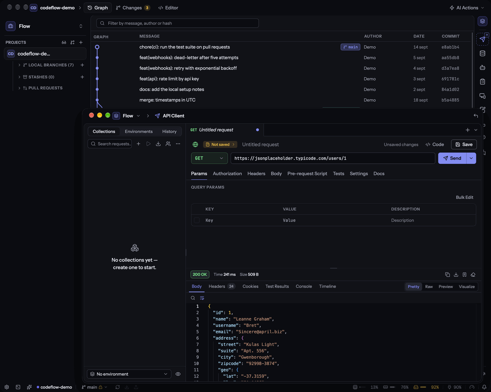
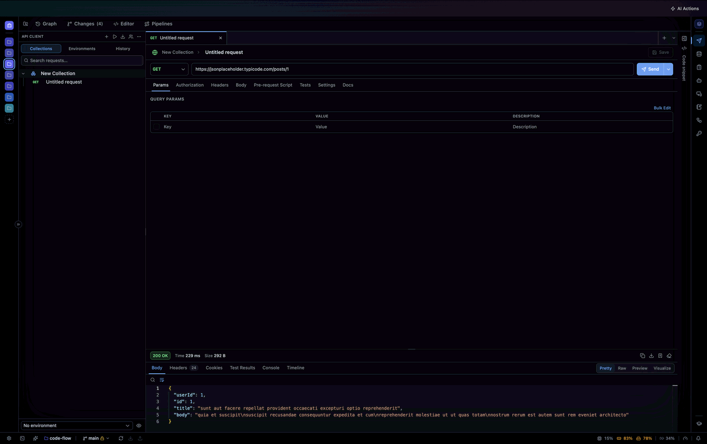
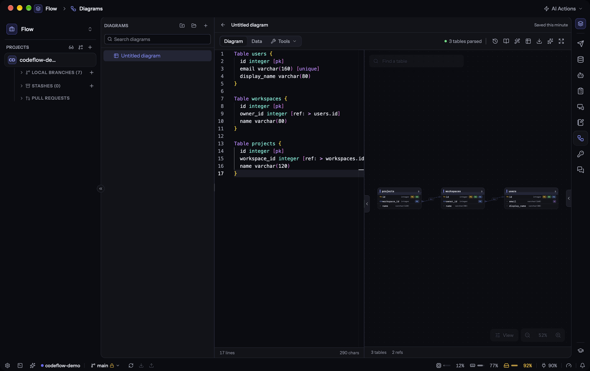
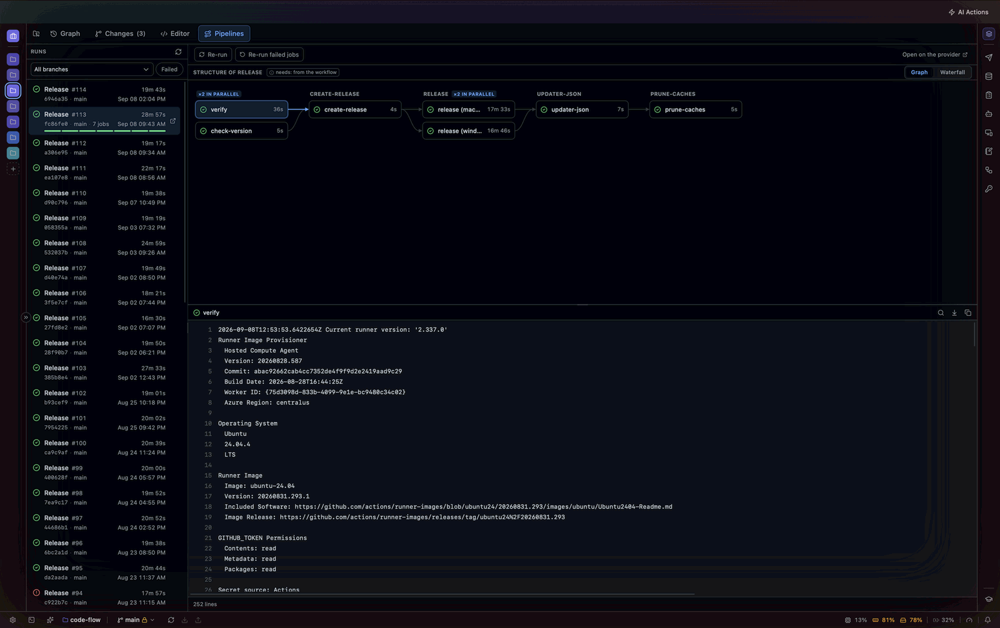
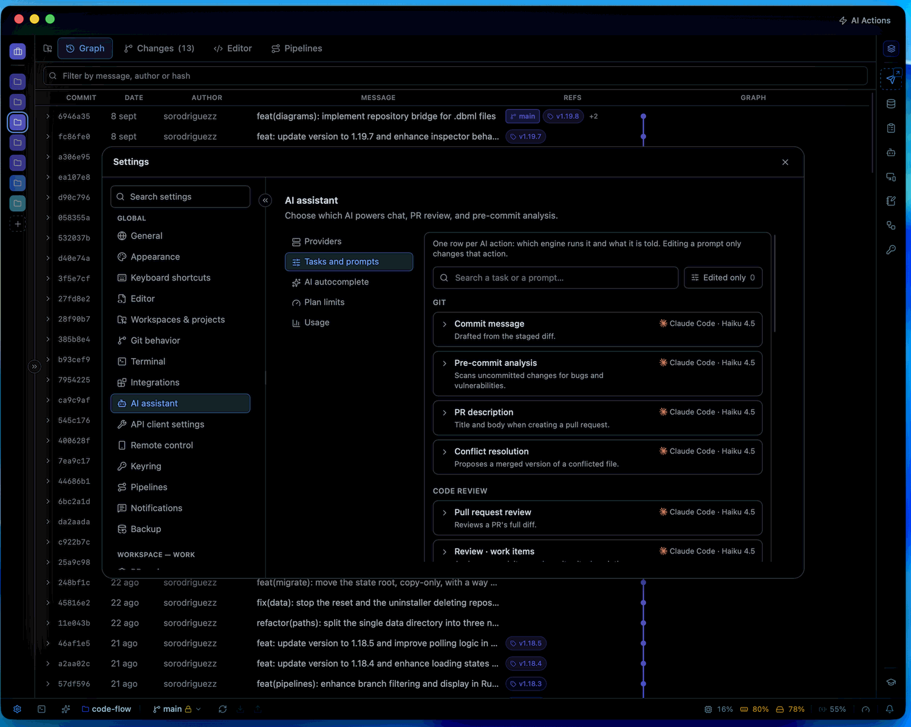
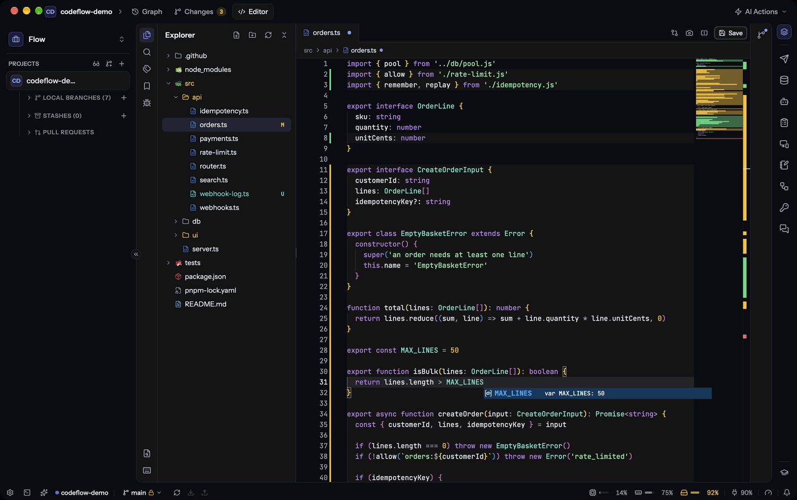
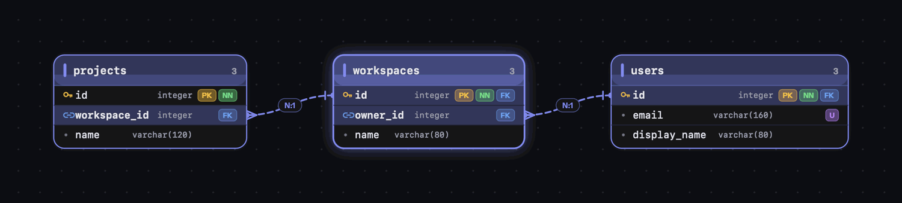

# CodeFlow

### Tu cliente de Git de escritorio, con la IA que tú elijas.

Lee tu historial, revisa el pull request, mira la build que viene detrás, convierte un documento en
un backlog y deja que la IA escriba tus commits, encuentre tus bugs y resuelva tus conflictos — en
una sola app nativa y rápida. Después prueba el endpoint que acabas de cambiar, consulta la base de
datos que hay detrás y entra por SSH a la máquina donde corre, sin salir de la ventana. **Tú decides
qué modelo hace qué.**

[English](README.md) · **Español**

El repositorio en la ventana principal, y el cliente de API sacado a una ventana propia.

---

CodeFlow reúne en un solo sitio lo que normalmente está repartido entre tu cliente de Git, la web de
GitHub/GitLab/Azure DevOps, tu tablero de Jira, monday o Azure, un cliente REST, una herramienta de
bases de datos, un cliente SSH y una terminal aparte. Lees tu historial, preparas y confirmas
cambios, abres y revisas pull requests, miras la build que viene detrás, escribes el backlog de lo
que viene y trabajas con un asistente de IA que entiende tu repositorio.

**Dos cosas que no vas a encontrar en otro cliente:** no te casa con un proveedor de IA — usa varios
a la vez y dale cada tarea al modelo que le venga bien, incluido uno **local** si tu código no puede
salir de tu máquina — y no es solo un cliente de Git. El rail del costado tiene una docena de
herramientas que comparten un mismo workspace, y cualquiera puede sacarse a una ventana propia.

## 🧩 Un workspace, una docena de herramientas

Cada icono del rail es una app completa, no un panel. Todas comparten el mismo **workspace**, así que
cambiar de cliente cambia a la vez los repositorios, las colecciones, las conexiones, las notas y las
credenciales — y ninguna se filtra a la ventana del cliente siguiente.

| | | |
|---|---|---|
| **Git** — grafo, diffs, ramas, stashes | **Pull requests** — GitHub · GitLab · Azure DevOps | **Pipelines** — la run como cascada, con logs |
| **Editor** — Monaco, LSP, autocompletado local | **Terminal y servicios** — en orden de dependencias | **Agentes** — roles con su propio modelo |
| **Cliente de API** — REST · GraphQL · WS · gRPC · MQTT | **Bases de datos** — Postgres · SQL Server · IRIS · Mongo · Redis | **Diagramas** — DBML y draw.io completo |
| **Remoto** — SSH, SFTP, port forwarding, S3 y Azure | **Notas** — cuadernos Markdown con panel de IA | **Llavero** — bóveda de contraseñas cifrada |
| **Historias** — un documento convertido en backlog | **Wiki** — documentación escrita desde el código | **Respaldos** — cifrados, programados, restaurables |

## 🪟 Ventanas propias

Una ventana es un gran sitio para trabajar y uno malo para comparar. Cualquier app del rail — o
cualquier repositorio — puede sacarse a una ventana propia: el cliente de API en una pantalla, la base
de datos en otra, y el repositorio que estás editando en el medio.

- **Separar mueve, nunca duplica.** No hay forma de pedir dos ventanas sobre lo mismo, así que nunca
  acabas con dos editores sobre un archivo pisándose en silencio. El icono del rail pasa a ser el
  camino *de vuelta* a esa ventana.
- **Cada ventana mantiene su propio workspace.** Cambiar de cliente en una no arrastra a las demás.
- **Solo la ventana principal maneja los relojes** — el sondeo, la comprobación de actualizaciones, la
  agenda de respaldos — así que cuatro ventanas no significan cuatro de todo.
- **Tú eliges cuántas** (0–8, cuatro por defecto), y Ajustes te dice lo que cuesta cada una en memoria
  antes de decidir.

## ✨ Un vistazo

<table>
  <tr>
    <td width="50%"></td>
    <td width="50%"></td>
  </tr>
  <tr>
    <td align="center"><b>IA</b> — seis motores detectados, un modelo por tarea</td>
    <td align="center"><b>Cliente de API</b> — seis protocolos, colecciones y entornos</td>
  </tr>
  <tr>
    <td width="50%"></td>
    <td width="50%"></td>
  </tr>
  <tr>
    <td align="center"><b>Diagramas</b> — un esquema en texto, dibujado mientras escribes</td>
    <td align="center"><b>Pipelines</b> — la ejecución como grafo, con sus logs</td>
  </tr>
</table>

## 🧠 La IA, a tu manera

Seis motores que tú conectas, más un séptimo que viene dentro de la app. CodeFlow **detecta cuáles
tienes instalados** y te dice lo que falta, en vez de dejarte adivinando por qué algo no funciona.

| Proveedor | Cómo funciona | Ideal para |
|---|---|---|
| **Claude Code** | CLI, con herramientas | Revisiones profundas y aplicar correcciones |
| **Codex** | CLI, con herramientas | Tu suscripción de ChatGPT, no créditos de API |
| **Gemini** | CLI (Antigravity), con herramientas | Una buena alternativa con cuenta de Google |
| **Grok** | CLI, con herramientas | Retoma la conversación exacta, no «la última» |
| **Open Code** | CLI, cualquier modelo que configures | Mezclar proveedores como quieras |
| **Cline** | CLI, con herramientas — 🔒 **local** vía Ollama, o cualquier API a la que lo apuntes | Privacidad total sin conexión, u OpenAI / OpenRouter / Groq / Azure con herramientas |

**Cline es además la puerta a cualquier endpoint compatible con OpenAI.** `cline auth openai` — o
cualquier base URL compatible configurada dentro — llega a los mismos servicios que llegaría una
casilla de API key, y llega *con herramientas*, así que corregir un hallazgo también funciona ahí.

### ⚡ Autocompletado que nunca sale de tu máquina

El séptimo motor no es un proveedor que instalas — **viene en el instalador**. Un `llama-server`
recortado va dentro de la app (22 MB en macOS, 38 MB en Windows) y escribe texto fantasma en el
editor mientras tecleas.

- **El modelo lo eliges y lo descargas una vez**, desde el catálogo en **Ajustes › Editor** — un 0.5B
  responde en menos de 200 ms en un portátil, y los grandes están ahí cuando los quieras. Las
  descargas se reanudan si se cae la conexión.
- **Perezoso por diseño**: el motor arranca con la primera sugerencia y se apaga cuando dejas de
  programar. Nada corre de fondo por haberlo instalado.
- **Sin conexión, gratis y tuyo.** Sin API key, sin factura por tokens, sin una línea de código
  saliendo de la máquina — útil incluso los días en que tu proveedor se cae.

### Un motor distinto para cada tarea

Aquí está la diferencia: no eliges «una IA» — eliges **quién hace qué**. Una fila por acción: qué
motor la ejecuta y qué se le dice.

| Tarea | Por ejemplo… |
|---|---|
| Mensaje de commit | Un modelo local: instantáneo, gratis, nunca sale de tu máquina |
| Análisis pre-commit | Algo rápido, porque corre en cada cambio |
| Revisión de pull request | El más capaz que tengas — aquí es donde se nota |
| Descripción del PR | El que mejor escriba |
| Corregir hallazgos | Uno con acceso a herramientas, para que edite los archivos |
| Resolver conflictos | El que prefieras, local incluido |

Todo lo que quede en **«heredar»** usa tu proveedor por defecto, así que puedes ignorar la tabla
entera si un solo modelo hace todo lo que necesitas. Y cambias de modelo **en dos clics** desde el
propio chat, sin pasar por Ajustes.

### Lo que hace por ti

- **Chatea con tu repo** — lee archivos, busca en el código y consulta el estado de Git para
  responderte.
- **Mensajes de commit** escritos a partir de lo que tienes preparado.
- **Análisis pre-commit** — encuentra bugs y vulnerabilidades antes de confirmar, con una puerta de
  calidad para fiabilidad, seguridad y mantenibilidad.
- **Corrige hallazgos en un clic** — la IA aplica el cambio en tu copia de trabajo.
- **Resuelve conflictos** — una propuesta editable, comparada contra el archivo original, que no toca
  nada hasta que aceptas.
- **Crea pull requests** con título y descripción generados a partir del diff.
- **Plantillas personalizables** para las cinco acciones, compartidas entre proveedores.

> 🔒 **¿Código que no puede salir de la empresa?** Pon Cline como proveedor, apúntalo a un modelo
> local (`cline auth ollama`) y todo lo anterior corre en tu máquina, sin conexión y sin coste por
> token — corregir hallazgos incluido, porque Cline maneja el modelo en vez de solo completar texto.

### Lo que te está costando

Un medidor en Ajustes mantiene **gasto y cuota del plan separados**, porque son preguntas distintas
con respuestas distintas: cuánto te han facturado por tokens, y cuánto del cupo de una suscripción se
ha comido el trabajo de hoy. Los proveedores que publican un límite lo muestran; los que no, lo dicen
claramente en vez de inventarse un número.

### Nada se pierde por mirar a otro lado

Todo lo que la IA arranca vive en segundo plano, no en la pantalla que lo lanzó.

- **Varias conversaciones a la vez**, sin tope: pregunta en una, abre otra y pregunta ahí mientras la
  primera sigue pensando.
- **Cambiar de chat, abrir un pull request o cerrar el panel no cancela nada.** La respuesta aterriza
  en la conversación que la pidió, esté en pantalla o no.
- **Actividad lo lista todo mientras corre** — chats, revisiones de PR, análisis pre-commit y
  correcciones — con la cuenta de cuántos siguen vivos. Un clic te devuelve donde estabas, con el log
  en vivo y el botón de detener todavía ahí.
- **El cronómetro dice la verdad**: cuenta desde que arrancó la tarea, no desde que volviste a
  mirarla.

## 🤖 Agentes que siguen trabajando cuando tú no

Un agente es un **rol con su propio motor**: un nombre, un modelo e instrucciones permanentes,
escritas una vez y reutilizadas. El documentador en un modelo barato, el revisor en el mejor que
tengas — sin tocar tus ajustes globales. Es la misma lista que usa el selector de agentes del chat,
así que no hay dos listas que mantener sincronizadas.

- **Tareas** — dale a un agente un objetivo y un repositorio, y vete. Sigue corriendo mientras cambias
  de vista o de workspace, y espera en **Tu turno** cuando necesita una respuesta tuya.
- **Cadenas** — varios agentes en fila, cada uno recibiendo el trabajo del anterior: arquitecto →
  implementador → revisor. Pon una **puerta** en cualquier paso y la cadena se detiene para mostrarte
  el mensaje exacto que va a enviar, que puedes editar antes de que salga.
- **Revisa lo que hizo** contra el diff real de ese repositorio, igual que revisarías tu propio
  trabajo.
- **Sube de modelo a mitad de conversación** cuando el trabajo resulta más difícil de lo que parecía.
- Si un paso falla, la cadena **se detiene y espera**: reintentar, saltar o abortar. Nunca entra en
  bucle ni se reejecuta sola.

> ⚠️ Los agentes editan tu copia de trabajo **de verdad**. Cada turno toma un punto de restauración
> antes de empezar, y solo corre un agente por repositorio a la vez — pero son tus archivos, no un
> sandbox. Para trabajar en paralelo, reparte el trabajo entre repositorios.

## 🌳 Git, visualmente

<table>
  <tr>
    <td width="50%"></td>
    <td width="50%"></td>
  </tr>
</table>

- **Grafo de commits** con ramas, para leer el historial de un vistazo.
- **Preparar, confirmar y descartar** cambios; diff **unificado o lado a lado**, seleccionable para
  copiar.
- **Ramas, remotos y stashes** a mano, con **deshacer commit** para cuando te equivocas.
- **Fetch automático en segundo plano**: siempre sabes cuántos commits llevas por delante o por
  detrás.
- **Clonar repositorios**, abrir varios proyectos y agruparlos en **workspaces**.
- **Escaneo de secretos antes de cada commit** — reglas deterministas, sin enviar nada a ningún
  sitio.
- **Esconde el ruido**: clic derecho sobre cualquier cosa del árbol para ocultarla de *tu* vista — un
  filtro por repositorio que nunca toca el disco ni llega a un commit.

## 📝 Un editor que no es un añadido

El mismo Monaco que ya conoces, conectado al repositorio que tiene alrededor.

- **Autocompletado local** mientras escribes, desde el motor incluido en la app — sin key, sin red.
- **Ir a definición, hover y diagnósticos** a través del language server del proyecto en el que
  estás.
- **Blame en línea** sobre la línea del cursor: quién la tocó por última vez, cuándo y en qué commit.
- **Editores divididos**, borradores que sobreviven a un reinicio, snippets, anidado de archivos y
  reglas de iconos propias.
- **Vista previa de Markdown y de diagramas** al lado del código fuente.
- **Ejecutar y depurar** con el Debug Adapter Protocol, con breakpoints y variables.
- **Una terminal y un dock de servicios** en el mismo panel: los *servicios* son del workspace, porque
  un sistema abarca varios repositorios, y las *terminales* son del repositorio donde se abrieron. Los
  servicios arrancan en orden de dependencias y cada uno espera una señal real — un puerto que abre,
  una sonda HTTP que responde o una línea que aparece en el log.

## 🚦 La build que viene detrás del push

Una pestaña **Pipelines** aparece en los repositorios enlazados a un host que tiene CI — **GitHub
Actions**, **GitLab CI** y **Azure Pipelines** — y se mantiene lejos de los que no, en vez de mostrar
una pantalla vacía.

- **Ejecuciones de más nueva a más antigua**, con estado, rama, commit, duración y **la fecha y hora
  de cada una**, filtrables por rama y por estado.
- **Una ejecución no es una lista de jobs, es una cascada** — el grafo muestra qué corrió realmente en
  paralelo y qué estuvo esperando, que es donde se fueron los minutos de verdad.
- **Logs de cada job en la app**, con ANSI intacto, para que una build en rojo no te mande a una
  pestaña del navegador.
- **En vivo mientras está en vivo**: una build corriendo se refresca sola y el tiempo transcurrido
  sigue contando.

## 🔀 Pull requests, sin salir de la app

- Conecta **GitHub**, **GitLab** y **Azure DevOps** — todos a la vez, si lo necesitas. Varias cuentas
  por host, también.
- **Revisa un PR pegando solo su enlace** (⇧⌘L): CodeFlow deduce a cuál de tus repos pertenece —
  incluso a uno de otro workspace — y arranca la revisión.
- ¿El repo no está en tu máquina? **Revísalo igual, sin clonar**: el diff se lee desde la API del
  host. Esa es una revisión más superficial (el modelo no ve el resto del código), así que también
  puedes clonarlo en un clic para la completa.
- **Lista, revisa y comenta** PRs; **aprueba, pide cambios o ciérralos**.
- **La revisión se planifica antes de gastar nada**: CodeFlow recorta cada archivo hasta los símbolos
  que el PR toca — el método entero, numerado, con `>` marcando lo que cambió — reparte el trabajo
  entre varios revisores en paralelo y cierra con una pasada entre archivos buscando lo que ningún
  revisor de un solo archivo puede ver: firmas que dejaron atrás a quien las llama, esquemas que se
  separaron.
- **Tres niveles de profundidad** (básico · completo · ultra) con un contrato real y no una sugerencia:
  umbral de confianza, severidades reportadas, lentes activas y paralelismo. Todo se edita en Ajustes →
  Revisión → Motor, se aplica en código y se congela en cada revisión guardada, para que una antigua
  siga diciendo qué reglas la produjeron.
- **Memoria que se consulta, no solo se guarda**: lo que ya se descartó sobre esos mismos archivos en
  otros PRs vuelve como contexto, y quién más en el repositorio referencia los símbolos que estás
  tocando llega como pista para cambios de contrato.
- **Crea un PR** con título y descripción de la IA, también como borrador.
- Publica los comentarios de la **revisión de la IA** directamente en el pull request.

## 📄 De un documento a un backlog — y al código

La parte del trabajo que suele comerse una reunión: convertir una especificación que nadie ha leído en
historias que alguien pueda construir. Funciona en cuatro direcciones, y todas comparten tu workspace,
tu conexión al tablero y tus repositorios.

### Escribir

Apúntalo a una página de wiki, a una carpeta de archivos Markdown o a texto que pegues, y recibe un
conjunto de historias de usuario — narrativa, criterios de aceptación en **Gherkin** listos para
Cucumber, una estimación, etiquetas y las preguntas que la documentación dejó sin responder.

- **Cada historia se puntúa localmente, sin ningún modelo de por medio.** La narrativa tiene sus tres
  partes, ningún escenario tiene dos «Cuando», cada criterio es testeable, la estimación está en la
  escala de Fibonacci. Es una comprobación en la que merece la pena confiar precisamente porque es la
  misma siempre — no una opinión que cambia en la siguiente ejecución.
- **Verifica contra tu código.** Cada criterio recibe un veredicto — cumplido, no cumplido, parcial,
  desconocido — respaldado por el archivo y la línea que lo demuestran. Así descubres qué está ya
  construido antes de planificarlo por segunda vez.
- **Exporta un archivo `.feature`** al repositorio, para que QA ejecute los criterios en vez de
  leerlos.
- **Publica** las historias que elijas en **Azure Boards**, **Jira** o **monday.com** — todos
  conectados a la vez, un tablero elegido por conjunto. En Azure llevan su área, iteración y
  etiquetas; en Jira sus labels y estimación; en monday, las columnas que tu tablero tenga de verdad,
  y el panel te dice cuáles emparejó antes de publicar.
- Todo es editable antes de eso: corrige un título, reescribe un escenario, descarta una historia. Los
  cambios se guardan al salir del campo.

### Revisar

Para una historia, bug o ítem que **ya existe** en el tablero. Pega su enlace — un work item de Azure,
un `PROJ-123` de Jira, un ítem de monday —, elige los repositorios que toca y descubre qué falta, en
tres pasadas que lanzas tú:

1. **Analizar** — qué le falta a la historia, juzgada por INVEST y testabilidad. Para un bug la vara es
   otra: reproducible, esperado, actual, alcance.
2. **Criterios** — los escenarios Gherkin que nadie escribió, basados en la historia *tal como está
   ahora mismo*, incluidas tus ediciones del paso anterior.
3. **Tareas** — el desglose en trabajo de desarrollo y QA, consciente de las tareas que ya tiene para
   no proponerlas dos veces.

Nada llega al tablero por su cuenta. Lo que quieras enviar pasa a una columna de publicación y lo
confirmas campo por campo, viendo exactamente qué va a cambiar antes de que cambie.

### Construir

Una historia no tiene por qué quedarse en el tablero. Dásela a una cadena de agentes y se convierte en
una rama:

- **Una historia, de uno a muchos repositorios.** Un cambio que abarca una API, un front y un esquema
  es una sola ejecución, no tres que tienes que mantener sincronizadas a mano.
- **Dos fases con una puerta humana en medio.** Primero planifica y te enseña el plan; no se escribe
  nada hasta que tú lo digas.
- Termina donde termina tu propio trabajo — en tu copia de trabajo, con un diff que leer.

### Wiki

La dirección contraria: lee el código y escribe la documentación técnica que las otras tres pestañas
dan por hecho que alguien escribió.

- **Por repositorio** — cómo se construye, se configura, se ejecuta en local y se despliega, incluidas
  sus variables de entorno, integraciones y base de datos.
- **Por workspace** — cómo encajan varios repositorios como sistema: quién llama a quién, los contratos
  entre ellos y dónde están acoplados.

Sale como Markdown editable, y se publica en tu wiki cuando dice lo que quieres decir.

## 🛰️ Un cliente de API, integrado

Prueba el endpoint que acabas de cambiar sin cambiar de app — en la misma ventana que el commit que lo
cambió.

- **Seis protocolos**: REST, GraphQL (con introspección del esquema), WebSocket, Socket.IO, gRPC (desde
  un archivo `.proto` o por reflexión del servidor) y MQTT.
- **Colecciones, carpetas y entornos**, con variables resueltas en todas partes — URL, cabeceras, body
  y autenticación.
- **Scripts previos y tests** en JavaScript, para que un login alimente la llamada siguiente.
- **Trae lo que ya tienes**: importa desde Postman, OpenAPI/Swagger, Insomnia, HAR o un comando cURL
  pelado. Exporta de vuelta a Postman, OpenAPI o al formato propio de CodeFlow.
- **Ejecuta una colección entera** y lee el resultado como un informe.
- **Genera el código** de una petición en el lenguaje en el que trabajas.
- **Comparte una colección con tu equipo** a través de **tu propio** proyecto de Supabase — lo alojas
  tú, así que las peticiones y sus secretos se quedan en infraestructura que controlas.

## 🗄️ Tus bases de datos, en la misma ventana

La consulta que necesitas comprobar está a una pestaña de la migración que acabas de escribir.

- **Seis motores**: PostgreSQL, Supabase, SQL Server, InterSystems IRIS, MongoDB y Redis.
- **Recorre el árbol** — esquemas, tablas, vistas, rutinas, secuencias, columnas, índices y claves.
- **Consola SQL** con historial, `EXPLAIN` y resultados exportables.
- **Edita filas en una grilla**: los cambios se preparan en local y ves las sentencias exactas antes de
  que se ejecute nada.
- **Lee el DDL** de cualquier objeto, y el **diagrama del esquema** con sus claves foráneas.
- **Conexiones de solo lectura** para las que no debes tocar por accidente, y un **túnel SSH** cuando la
  base de datos está detrás de un bastión.
- Las contraseñas van al **llavero del sistema**, nunca a la base de datos de la app.

## 📐 Esquemas que puedes escribir, dibujar y probar

Un esquema escrito en **DBML** se dibuja mientras tecleas — y el dibujo no es de solo lectura.

- **Editar con un clic.** Renombra una tabla, añade una columna, traza una relación desde el lienzo o
  desde el inspector. Cada gesto se aplica como una **edición de texto**, así que ⌘Z lo deshace como si
  fuera una pulsación y tus comentarios, líneas en blanco y formato sobreviven intactos.
- **Pruébalo con filas reales.** La superficie **Datos** construye una SQLite efímera a partir del
  diagrama, te da una grilla para llenarla a mano — las claves foráneas se vuelven selectores sobre
  filas padre reales — y una consola SQL libre sin protecciones de producción, porque aquí
  `DELETE FROM usuarios` es algo que escribes a diario. Una barra de deriva te avisa cuando el diagrama
  se ha movido por debajo de los datos.
- **Genera el SQL** de tu motor, **importa un esquema existente** y **compara** dos versiones lado a
  lado.
- **Un archivo `.dbml` del repositorio es el mismo documento.** Ábrelo desde el editor y el archivo en
  disco sigue siendo el medio: el diagrama lo escribe, el editor lo escribe, ninguno recarga sobre
  trabajo sin guardar, y una ventana de diagramas separada oye el guardado que acaba de hacer el
  editor.

Junto a eso, el editor completo de **draw.io** va embebido en la app — todas las bibliotecas de formas,
sin conexión — para los diagramas de flujo, C4 y secuencia que no son una base de datos. Exporta a PNG,
SVG o PDF.

## 🖥️ Las máquinas donde corre tu código

Un cliente SSH que sabe que vive al lado de tus repositorios, en el mismo workspace que ellos.

- **Sesiones de terminal por SSH**, con tus llaves o con contraseña, y **hosts importados de tu
  `~/.ssh/config`** en vez de escritos otra vez.
- **Archivos en ambos sentidos por SFTP y FTP**, para que sacar un log de un servidor no sea un cambio
  de contexto.
- **Reenvío de puertos** para la base de datos, el depurador o la app de staging detrás de un bastión.
- **Almacenamiento en la nube en el mismo árbol**: Azure **Blob**, **Queue**, **Table** y **File
  shares**, y **Amazon S3** — recorre buckets y contenedores, sube, descarga y borra, con la clave de la
  cuenta en el llavero del sistema y nunca en la conexión que guardaste.

## 📓 Notas, al lado del código que explican

Cuadernos en Markdown para lo que se escribe *alrededor* del trabajo — la decisión, el runbook, el
postmortem — con plantillas para los documentos que escribes más de una vez y un panel de IA que
redacta y reescribe sin salir de la página. **Por workspace**, para que las notas de un cliente no
aparezcan en la ventana de otro.

## 🔑 Llavero, un gestor de contraseñas en la app

Las credenciales que el trabajo necesita, en la ventana donde ocurre el trabajo — no en un archivo de
texto en el escritorio.

- **Una contraseña maestra**, estirada con Argon2id, que desenvuelve una clave que sella cada ítem con
  AES-256-GCM. Cambia la contraseña y se re-envuelven 32 bytes: no puede quedarse a medias y dejar el
  resto recifrado.
- **Sin verificador guardado.** Una contraseña incorrecta no consigue desenvolver la clave, y eso *es*
  la comprobación — no hay nada en disco que diga cómo es la respuesta correcta.
- **Se bloquea solo** al cabo de un rato, y comprueba al usar y no solo por temporizador — un portátil
  dormido no corre temporizadores.
- Ítems, carpetas, adjuntos y un registro de auditoría de qué se abrió y cuándo.

## 📱 Tu teléfono, cuando no estás en la máquina

Enciende el servidor de control remoto en Ajustes, escribe en el navegador de tu teléfono los seis
dígitos que muestra, y la app tiene una segunda pantalla — sin tienda de apps, sin cuenta, sin nada
publicado en internet.

- **Mira lo que está corriendo**: tareas y cadenas de agentes, en vivo, y responde a las que esperan en
  *Tu turno* desde donde estés.
- **Revisa un pull request**, lee el repositorio y sigue chateando con el asistente.
- **Una terminal en tu máquina**, si lo permites — con su propio interruptor, apagado salvo que lo
  enciendas.
- **Cada dispositivo es revocable** uno a uno desde el escritorio, y administrar la función es algo que
  solo puede hacer la máquina: un teléfono emparejado no puede abrir una ventana de emparejamiento,
  mover el puerto ni revocar al dispositivo de al lado.

## 🛟 Copias de seguridad que se pueden restaurar

- **Cifradas con una frase de paso que eliges tú**, y todo en un solo archivo: ajustes, conexiones,
  colecciones, notas, diagramas, revisiones, trabajo de agentes y — si quieres — tus credenciales.
- **Programadas y al salir**, conservando el número de copias que pidas.
- **Donde tú digas**: una carpeta, **Google Drive** o **OneDrive**.
- **La app nunca borra tus repositorios ni tus copias** — ni un reinicio de fábrica, ni el
  desinstalador. Viven en tu propia carpeta y ahí se quedan.

## 🔒 Seguridad y privacidad

- **Escaneo de secretos antes de cada commit** — detecta API keys, tokens y llaves privadas, y te para
  a tiempo. Reglas deterministas, sin enviar nada a ningún sitio.
- Tus **tokens viven en el llavero del sistema**, nunca en texto plano.
- **Datos por usuario.** La base de datos, los ajustes y la bóveda viven en los datos de aplicación de
  tu propia cuenta, donde otra cuenta de la misma máquina no puede leerlos.
- **Dos maneras de estar totalmente sin conexión**: Cline sobre Ollama para el trabajo conversacional, y
  el motor incluido para el autocompletado. Tu código nunca sale de la máquina.
- Es una app de escritorio: sin cuenta en la nube, sin telemetría. El único servidor es el que enciendes
  tú para tu teléfono, en tu propia red, y que vuelves a apagar.

## 🎨 Hazla tuya

- Temas **claro, oscuro o del sistema**, con el color de acento que elijas.
- Interfaz en **español e inglés**.
- **Un tour guiado en el primer arranque** que recorre la app pantalla por pantalla — y que puedes
  dejar y retomar, porque cada paso recuerda dónde estaba.
- **El rail de apps se ordena a tu gusto**: mantén pulsado un icono y muévelo, para que los espacios en
  los que vives queden bajo tu pulgar.
- **Una paleta de comandos** (⇧⌘P) y **atajos reasignables** para todo lo que haces dos veces.
- **Plantillas de prompt** para commit, análisis, revisión, descripción de PR y conflictos — y para
  escribir historias, verificarlas y generar documentación, para que el backlog salga con el estilo de
  tu equipo.
- Las de **revisión de PR** son seis, una por cada parte del motor: las lentes, la profundidad de cada
  nivel, el revisor paralelo, la pasada entre archivos y el resumen final. Los números no se escriben
  dentro — llegan desde la pestaña Motor mediante marcadores tipo `{{MIN_CONFIANZA}}`, así que
  reescribir la redacción nunca puede descuadrar la instrucción y el filtro que la aplica.
- Por workspace: **contexto de revisión**, **instrucciones (.md)** y **Skills**.
- **Un historial completo** de lo que ha hecho la IA — fallos incluidos, para que mañana sepas qué pasó.

## ⚙️ Primeros pasos

**1. Abre tu repositorio**
Pulsa **+** en la barra lateral y elige una carpeta con un repositorio Git. Repite las veces que
quieras y agrúpalos en workspaces.

**2. Elige tu asistente de IA**
**Ajustes › Asistente de IA › Proveedores** muestra los seis motores con su estado (*Disponible* / *No
encontrado*). Despliega el que quieras, comprueba su binario y elige un modelo. Márcalo como **por
defecto** y listo.

**3. Enciende el autocompletado (opcional)**
**Ajustes › Editor** descarga un modelo de completado una vez y el editor empieza a sugerir. El motor
ya está instalado — no hay nada más que configurar, y nada sale de tu máquina.

**4. Afínalo por tarea (opcional)**
En **Modelo por tarea**, dale a cada acción un motor distinto. Todo empieza en «heredar», así que solo
tocas lo que quieras cambiar.

**5. Conecta tu plataforma (opcional)**
En **Ajustes › Hosting Git**, conecta **GitHub**, **GitLab** o **Azure DevOps** para ver y revisar pull
requests y mirar sus pipelines — y, en Azure DevOps, para leer wikis. **Jira** y **monday.com** se
conectan en la misma pantalla — no alojan código, así que aparecen para tu backlog y no para los pull
requests. Los tokens se guardan en el llavero de tu sistema operativo, nunca en la base de datos de la
app.

> 💡 ¿Quieres probarlo sin cuenta? Instala [Ollama](https://ollama.com), ejecuta
> `ollama pull qwen2.5-coder`, luego `npm install -g cline` y `cline auth ollama`. Selecciona **Cline**
> en Ajustes con el modelo `ollama/qwen2.5-coder`. Sin cuentas, sin claves.

## 💾 Descarga

Disponible para **Windows** y **macOS**. Consigue la última versión en
**[Releases](../../releases)**, ejecuta el instalador y ábrelo. La app **se actualiza sola** cuando
llega una versión nueva.

Puede seguir corriendo en segundo plano (icono en la bandeja) para que tus terminales y tareas de IA
sigan vivas aunque cierres la ventana.

## 🌐 Idiomas

Español e inglés, intercambiables en cualquier momento desde **Ajustes › General**.

## 📜 Licencia

CodeFlow es software de **código visible, no de código abierto** — mira [`LICENSE`](LICENSE) (con
[traducción informativa al español](LICENSE.es.md)).

- **Úsala, gratis.** Descárgala desde [Releases](../../releases) y úsala para lo que quieras,
  personal o en el trabajo, en tantas máquinas como quieras. Lo que construyas con ella es tuyo: la
  licencia no reclama nada sobre tu código, tus datos ni tus resultados.
- **Lee el código y manda pull requests** — mira [CONTRIBUTING.md](CONTRIBUTING.md).
- **Lo que no puedes hacer:** redistribuirla, modificarla, bifurcarla hacia tu propio producto,
  venderla, ofrecerla como servicio alojado, ni usar su código para entrenar un modelo.

Copyright © 2026 Sebastián Rodríguez Zapata. Todos los derechos reservados.

---

Hecho para quien quiere Git, revisiones e IA en un solo flujo. 💜

